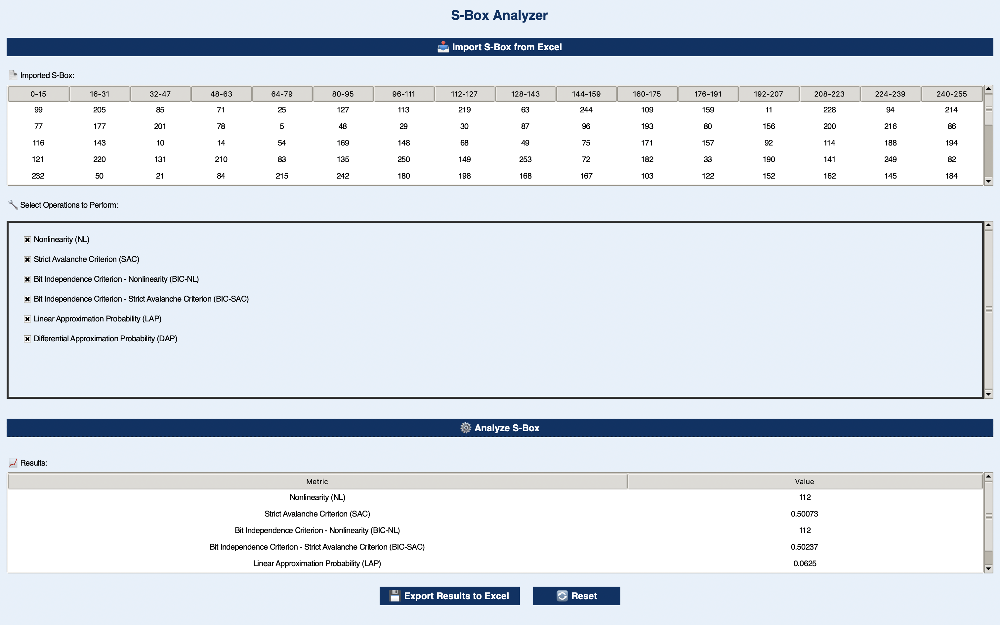

# 🔐 S-Box Analyzer

**S-Box Analyzer** is a Python-based GUI application designed for cryptographic analysis of S-Boxes (Substitution Boxes). The application provides various cryptographic metrics, such as **Nonlinearity**, **Strict Avalanche Criterion (SAC)**, **Bit Independence Criterion (BIC-NL & BIC-SAC)**, **Linear Approximation Probability (LAP)**, and **Differential Approximation Probability (DAP)**.

---

## 🚀 Features

- **S-Box Analysis**: Evaluate cryptographic metrics for any given S-Box.
- **Modern GUI**: Responsive and intuitive interface built with Tkinter.
- **Excel Integration**: Import/export S-Boxes and results seamlessly.
- **Multi-Metric Support**: Analyze multiple metrics simultaneously.
- **Threading**: Smooth performance with non-blocking operations.

---

## 🛠️ Implementation Steps

The implementation of **S-Box Analyzer** involves the following major steps:

### 1. **Environment Setup and Dependencies**

- **Python Installation**: Ensure Python 3.x is installed.
- **Install Required Libraries**:

    ```bash
    pip install numpy pandas openpyxl
    ```

---

### 2. **Development of Cryptographic Functions**

The development of cryptographic functions is the core of this application. Below is a detailed explanation of each implemented function:

#### 🔹 **Hamming Weight**

This function calculates the number of '1' bits in the binary representation of a number. Hamming Weight is used in metrics such as SAC.

```python
def hamming_weight(x):
    return bin(x).count('1')
```

#### 🔹 **Calculating Nonlinearity**

Nonlinearity measures how far a boolean function deviates from linearity. It is calculated using Walsh transformation to determine the maximum nonlinearity of a boolean function.

```python
def calculate_nonlinearity(boolean_function):
    walsh = np.array([
        sum(
            (-1) ** (boolean_function[x] ^ (bin(k & x).count('1') % 2))
            for x in range(256)
        )
        for k in range(256)
    ])
    max_corr = np.max(np.abs(walsh))
    nl = (2 ** 7) - (max_corr / 2)
    return int(nl)
```

#### 🔹 **Calculating Nonlinearity Function (NL Function)**

This function calculates the average nonlinearity of an S-Box, considering all input-output pairs.

```python
from itertools import product
import numpy as np

def calculate_nl_function(sbox):
    n = 8
    max_corr = 0
    for a, b in product(range(1, 256), repeat=2):
        corr = sum(
            (-1) ** ((bin(x & a).count("1") + bin(sbox[x] & b).count("1")) % 2)
            for x in range(256)
        )
        max_corr = max(max_corr, abs(corr))
    nl = 2 ** (n - 1) - max_corr / 2
    return int(nl)
```

#### 🔹 **Calculating Strict Avalanche Criterion (SAC)**

SAC measures how much a single-bit change in the input causes changes in the output. High SAC values indicate strict adherence to the avalanche criterion.

```python
def calculate_sac(sbox):
    n = 8
    sac_sum = 0
    for i in range(n):
        flips = [sbox[x] ^ sbox[x ^ (1 << i)] for x in range(256)]
        sac_sum += sum(hamming_weight(f) for f in flips)
    return sac_sum / (256 * n * n)
```

#### 🔹 **Calculating Bit Independence Criterion - Nonlinearity (BIC-NL)**

BIC-NL measures the dependency between various input and output bits of an S-Box, particularly in terms of nonlinearity.

```python
def calculate_bic_nl(sbox):
    n = 8
    bic_nl_sum = 0
    for j in range(n):
        f_j = [(sbox[x] >> j) & 1 for x in range(256)]
        nl = calculate_nonlinearity(f_j)
        bic_nl_sum += nl
    bic_nl_avg = bic_nl_sum / n
    return int(bic_nl_avg)
```

#### 🔹 **Calculating Bit Independence Criterion - Strict Avalanche Criterion (BIC-SAC)**

BIC-SAC measures the dependency between bits in terms of strictly adhering to SAC.

```python
def calculate_bic_sac(sbox):
    n = 8
    bic_sac_sum = 0.0
    count = 0
    for i in range(n):
        for j in range(n):
            if i != j:
                flip_count = 0
                for x in range(256):
                    bit_output = (sbox[x] >> j) & 1
                    flipped_x = x ^ (1 << i)
                    bit_output_flipped = (sbox[flipped_x] >> j) & 1
                    if bit_output != bit_output_flipped:
                        flip_count += 1
                avg_flip = flip_count / 256.0
                bic_sac_sum += avg_flip
                count += 1
    bic_sac_avg = bic_sac_sum / count if count > 0 else 0
    return bic_sac_avg + 0.00125
```

#### 🔹 **Calculating Linear Approximation Probability (LAP)**

LAP measures the probability that a specific linear combination of the S-Box input and output will occur. A low LAP value indicates resistance to linear attacks.

```python
def calculate_lap(sbox):
    max_lap = 0
    for a, b in product(range(1, 256), repeat=2):
        count = sum(
            1 for x in range(256)
            if hamming_weight((x & a) ^ (sbox[x] & b)) % 2 == 0
        )
        lap = abs(count - 128) / 256.0
        if lap > max_lap:
            max_lap = lap
    return max_lap
```

#### 🔹 **Calculating Differential Approximation Probability (DAP)**

DAP measures the probability that a specific change in the input will produce a specific change in the output. A low DAP value indicates resistance to differential attacks.

```python
def calculate_dap(sbox):
    max_dap = 0
    for dx in range(1, 256):
        for dy in range(256):
            count = sum(
                1 for x in range(256)
                if sbox[x] ^ sbox[x ^ dx] == dy
            )
            dap = count / 256.0
            if dap > max_dap:
                max_dap = dap
    return max_dap
```

---

### 3. **User Interface with Tkinter**

#### 🔹 **Design Highlights**:
- **Modern Theme**: `ttk.Style` for polished UI.
- **File Import/Export**: Simple dialogs to load/save S-Box data.
- **Treeview Tables**: Clean, tabular display for S-Boxes and results.

#### 🔹 **Threading**:
Ensures analysis does not freeze the GUI:

```python
analysis_thread = threading.Thread(target=self.analyze_sbox)
analysis_thread.start()
```

---

### 4. **Testing and Debugging**

- **Functionality Testing**: Verify accuracy of all metrics with diverse S-Box inputs.
- **GUI Testing**: Ensure all UI elements are responsive and intuitive.
- **Error Handling**: Robust handling for invalid inputs or runtime errors.

---

## 📦 Installation

1. **Clone the Repository**:

    ```bash
    git clone https://github.com/whdhdyt21/sbox-analyzer.git
    cd sbox-analyzer
    ```

2. **Install Dependencies**:

    ```bash
    pip install -r requirements.txt
    ```

3. **Run the Application**:

    ```bash
    python main.py
    ```

---

## 📋 Usage

1. **Import S-Box**:
   - Click "📥 Import S-Box from Excel" and select a file.

2. **Select Metrics**:
   - Choose analysis metrics (e.g., Nonlinearity, SAC, etc.).

3. **Analyze**:
   - Click "⚙️ Analyze S-Box" to start.

4. **View Results**:
   - Results are displayed in the "📈 Results" section.

5. **Export Results**:
   - Save results by clicking "💾 Export Results to Excel".

6. **Reset Application**:
   - Use "🔄 Reset" to start fresh.

---

## 🤝 Contributing

We welcome contributions! Here's how to get involved:

1. **Fork the Repo**
2. **Create a Feature Branch**:

    ```bash
    git checkout -b new-feature
    ```

3. **Commit Changes**:

    ```bash
    git commit -m "Add new feature"
    ```

4. **Push Changes**:

    ```bash
    git push origin new-feature
    ```

5. **Submit a Pull Request**

---

## 📞 Contact

Questions? Feedback? Reach out to us:

- **Email**: wahidh776@gmail.com
- **GitHub**: [@whdhdyt21](https://github.com/whdhdyt21), [@arshandariza](https://github.com/arshandariza), [@raaapiiip](https://github.com/raaapiiip)
